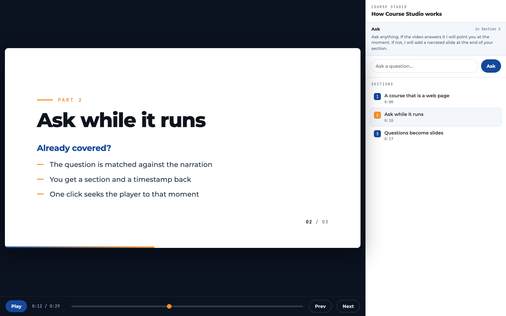
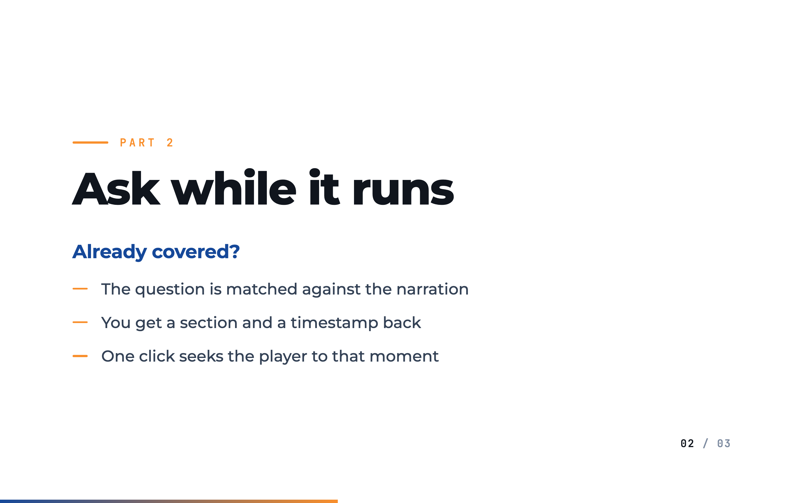
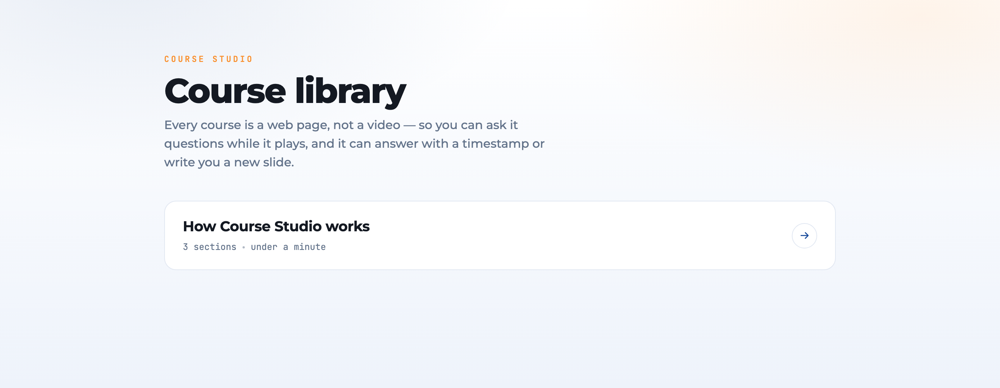

<div align="center">

# Course Studio

### Courses that are web pages, not video files — so they can answer back.

A course player that turns a narrated presentation into something you can interrogate
while it runs. Ask a question: if the course already covers it, you get the section and
the timestamp. If it doesn't, the course **writes a new slide, narrates it, and drops it
in** at the end of the section you were watching.

That last part is why the course is a page and not an `.mp4`. You cannot insert a slide
into a finished video.

[](LICENSE)




</div>

---

## What it does



**The course is live markup.** A page that plays itself against one `<audio>` element,
driven by `timeupdate`. Every slide is DOM — text you can select, elements that can be
restyled, and a document that can grow.

**Ask while it runs.** The question is matched against the narration. Already answered?
You get *"Section 2, 4:18"* and one click seeks you there. Not answered? It becomes a new
slide.

**Vague questions get clarified first.** Two rounds maximum, then it commits to an answer
rather than interrogating you forever.

**Narration is local and free.** [Kokoro-82M](https://huggingface.co/hexgrad/Kokoro-82M)
through any OpenAI-compatible `/v1/audio/speech` endpoint. No per-character billing for a
slide nobody may ever see again.

<br clear="right">

---

## Quick start

No dependencies — the server is Python standard library only.

```bash
git clone https://github.com/nexibeo/Education-Course-Studio.git
cd Education-Course-Studio
python3 server.py                      # http://127.0.0.1:8900
```

A demo course ships with the repo, so that already works. Open
**http://127.0.0.1:8900/c/demo**.

To answer questions and generate slides you need two more things:

```bash
export OPENROUTER_API_KEY=sk-or-...    # or put it in .env — see .env.example
                                       # and a Kokoro server on :8880 for narration
```



---

## How a course is put together

A course is a directory. Anything matching this shape plays:

```
courses/<id>/
  course.json        sections with t0/t1, so the player can seek
  site/index.html    a page that plays itself against an <audio>
  site/voice.mp3     the narration
```

That's the whole contract. [`make_demo.py`](make_demo.py) is the shortest readable
implementation of it — three sections, hand-written, about 200 lines. Read that first if
you want to plug in your own renderer.

```bash
python3 make_demo.py               # rebuild the demo
python3 make_demo.py --no-audio    # no TTS server needed; plays silently
```

### The one external dependency

Course Studio **plays** courses; it is not primarily a course *generator*. The rich
courses it was built for come from a separate pipeline (VideoGenerator) that takes a
source video and rebuilds it for a specific audience — retargeted narration, recreated
screenshares, the lot. That project is not part of this repo.

You have three ways to get a course in:

| route | what you need |
| --- | --- |
| **`make_demo.py`** | nothing — it writes the contract by hand |
| **`generate.py`** | an OpenRouter key; turns a Markdown script into a course |
| **`ingest.py`** | a VideoGenerator build directory (`CS_VIDEOGENERATOR`) |

```bash
python3 generate.py --script sources/my-topic.md \
  --title "Understanding AI Agents" \
  --audience "business professionals with no engineering background" \
  --out courses/agents
```

---

## Media on Cloudflare R2

A course is mostly audio — a couple of hundred kilobytes of markup against four to ten
megabytes of narration. That's fine on disk and bad in git, because every re-narration
writes a new blob and git never forgets a binary.

So point the media somewhere else:

```bash
npx wrangler r2 bucket create course-media
python3 publish_r2.py --course courses/hotel --bucket course-media

CS_MEDIA_BASE=https://your-r2-domain.example python3 server.py
```

The server rewrites the course page's `<audio>` to the CDN **in memory** — the build on
disk is never modified, and unsetting the variable puts everything back on local files.

> R2 buckets are private by default. `publish_r2.py` deliberately does **not** make yours
> public; attach a custom domain or enable the `r2.dev` URL yourself, in the dashboard.
> Making a bucket world-readable should be a deliberate click.

---

## Configuration

| variable | default | what it does |
| --- | --- | --- |
| `OPENROUTER_API_KEY` | — | required for Q&A and `generate.py` |
| `CS_TTS` | `http://127.0.0.1:8880/v1/audio/speech` | any OpenAI-compatible speech endpoint |
| `CS_MODEL` | `deepseek/deepseek-v4-pro` | model used for answers and planning |
| `CS_MEDIA_BASE` | *(unset)* | CDN origin for narration; unset = local files |
| `CS_BRAND` | `Course Studio` | the name in the player header |
| `CS_ENV_FILE` | `.env` | where to look for the key |
| `CS_VIDEOGENERATOR` | `../VideoGenerator` | build directory for `ingest.py` |

---

## What's in here

| file | lines | what it is |
| --- | --- | --- |
| `server.py` | ~280 | HTTP server, routes, range requests so audio can seek |
| `player/player.html` | ~360 | the player — course iframe, Ask box, section list |
| `generate.py` | ~390 | Markdown script → course |
| `qa.py` | ~280 | clarify / already-covered / author a new slide |
| `ingest.py` | ~200 | VideoGenerator build → `course.json` |
| `kokoro_tts.py` | ~175 | local narration |
| `make_demo.py` | ~200 | the demo, and a readable statement of the contract |
| `publish_r2.py` | ~110 | push media to Cloudflare R2 |

---

## Honest status

A **working prototype**, not a product. Being straight about it:

- **Single user, localhost.** No auth, no accounts, no multi-tenancy. Don't expose it.
- The Q&A loop works but has had light real-world use.
- Generated slides use the base renderer's frame types, so they're plainer than
  pipeline-authored ones.
- No `.mp4` export. By design — but it means nothing to upload to YouTube.

Issues and PRs welcome. If you build a different producer for the course contract, that's
the most interesting thing you could contribute.

---

## Credits

Built by **[Jeroen Erne](https://www.linkedin.com/in/jeroenerne/)**.

- **[Nexibeo](https://nexibeo.com)** — AI systems and automation.
- **[Complete AI Training](https://completeaitraining.com)**
  ([LinkedIn](https://www.linkedin.com/company/completeaitraining)) — where the courses
  this was built for actually live.

Inspired by **[OpenMAIC](https://github.com/THU-MAIC/OpenMAIC)**, which is where the idea
of splitting a generated course into navigable sections came from. Course Studio shares no
code with it and took a deliberately different path — live HTML driven by an audio
timeline, rather than a generated slide deck. If you want a full classroom platform, look
at OpenMAIC; if you want a course that rewrites itself while someone watches, this is that.

## License

[MIT](LICENSE) © Nexibeo
